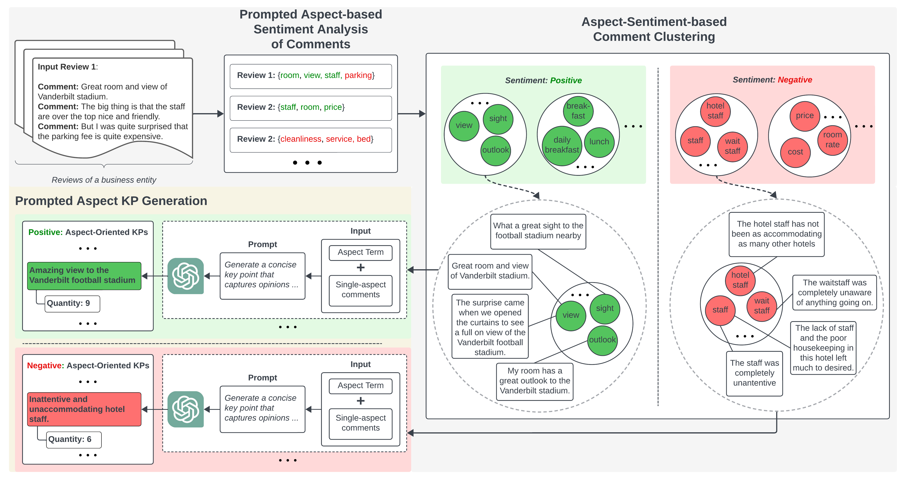

<div align="center">

# Prompted Aspect KPA (PAKPA): Quantitative Review Summarization

</div>

This repository maintains the code, data, and model checkpoints for the paper *Prompted Aspect Key Point Analysis for Quantitative Review Summarization*

[//]: # (# Code to release soon.)

## Installation
It is recommended to set up the environment and install required libraries using conda. 
It is also recommended that the machine should have GPUs to perform inference at a reasonable time.  
### 1. Create new virtual environment by
```bash
conda create --name pakpa python=3.9
conda activate pakpa
```
### 2. Install Pytorch
#### Windows or Linux
##### Using GPUs
```bash
conda install pytorch torchvision torchaudio pytorch-cuda=11.8 -c pytorch -c nvidia
```
##### Using CPU
```bash
conda install pytorch torchvision torchaudio cpuonly -c pytorch
```
#### Mac
```bash
conda install pytorch::pytorch torchvision torchaudio -c pytorch
```
For other versions, please visit: [https://pytorch.org/get-started/locally/](https://pytorch.org/get-started/locally/)

### 3. Additional packages
We need some additional packages to run the code. The list of packages is listed in ```requirements.txt```. On the main directory of the repository, run:
```bash
pip install -r requirements.txt
```

## Framework


We propose a pipeline framework, namely Prompted Aspect Key Point Analysis (PAKPA), for quantitative opinion summarization for business reviews. 
PAKPA employ aspect sentiment analysis to identify aspects in comments as the opinion target and then  generate and quantify KPs grounded in aspects and their sentiment. 
The below figure illustrates PAKPA framework with examples.
Given reviews for a business entity, 
PAKPA performs KPA for reviews and 
generates KPs of distinctive aspects and quantities measuring the prevalence of KPs. PAKPA consists of three components/stages: 
- **Stage 1: Prompted ABSA of Comments**
- **Stage 2: Aspect-Sentiment-based Comment Clustering**
- **Stage 3: Prompted Aspect KP Generation**

## Dataset
We released both the Yelp and SPACE datasets used in our evaluation tasks (dimensions) of KPs. Datasets can be accessed under the ```data/``` folder, 
following the [```yelp/```](/data/yelp) and [```space/```](/data/space) subdirectories for each dataset.

[//]: # (In each dataset directory, )

[//]: # (- ```input_reviews/``` contains the raw input dataset file and also samples from the dataset for experiment)

[//]: # (- ```process_absa_reviews/``` consists of reviews already analyzed for ABSA predictions &#40;Stage 1&#41;)

[//]: # (- ```review_comments_clustered/``` consists of clusters of comments already clustered by their similar aspect terms &#40;Stage 2&#41;)

[//]: # (- ```summaries/``` consists of the final KP summaries produced by the framework &#40;Stage 3&#41;)

Files in each folder:
* ```input_reviews.pkl```: Raw input samples from the dataset for experiment.
* ```reviews_absa_processed.pkl```: Reviews already analyzed for ABSA predictions &#40;Stage 1&#41;
* ```reviews_clustered.pkl```: clusters of comments already clustered by their similar aspect terms &#40;Stage 2&#41;)
* ```summaries.pkl```: final KP summaries produced for the clusters by the framework &#40;Stage 3&#41;)

## Inference
We offer two options to perform inference of our pipeline framework (PAKPA), using Jupyter Notebook files (```notebook```) or Python inference scripts (```script```). 
Each file in the respective folder represent a stage of the pipeline. Below is the directory structures for stages of the pipeline:
```
notebook
├── yelp
│   ├── Prompted_ABSA.ipynb
│   ├── Aspect_Sentiment_Comment_Clustering.ipynb
│   ├── Prompted_Aspect_KPG.ipynb
├── space
│   ├── Prompted_ABSA.ipynb
│   ├── Aspect_Sentiment_Comment_Clustering.ipynb
│   ├── Prompted_Aspect_KPG.ipynb
│   ├── Automatic_KP_Quality_Evaluation.ipynb
script
├── prompted_absa.py
├── aspect_sentiment_comment_clustering.py
├── prompted_aspect_kpg.py
```
File description:
* ```Prompted_ABSA.ipynb``` or ```prompted_absa.py``` : Perform Stage 1 on input reviews
* ```Aspect_Sentiment_Comment_Clustering.ipynb``` or ```aspect_sentiment_comment_clustering.py```: Perform Stage 2 on reviews already analyzed for ABSA
* ```Prompted_Aspect_KPG.ipynb``` or ```prompted_aspect_kpg.py```: Perform Stage 3 on clusters of comments
* ```Automatic_KP_Quality_Evaluation.ipynb```: Automatic evaluation of KP Quality with reference summaries as ground truth (only applicable for SPACE dataset)

### Hosting an LLaMas model for Prompted ABSA
We used [FastChat](https://github.com/lm-sys/FastChat/tree/main) to host a LLaMas for prompted in-context learning of ABSA.
FastChat provides OpenAI-compatible APIs for its supported models, so you can use FastChat as a local drop-in replacement for OpenAI APIs.
The FastChat server is compatible with both [openai-python](https://github.com/openai/openai-python) library and cURL commands.

**Note:** *Vicuna-7B is used as the LLMs for Prompted ABSA. This model requires around 14GB of GPU memory.
If you do not have enough memory, you can enable 8-bit compression by adding --load-8bit to commands below. This can reduce memory usage by around half with slightly degraded model quality.
For more information to reduce memory requirement or instruction to run on other architectures, please see this [link](https://github.com/lm-sys/FastChat/tree/main?tab=readme-ov-file#inference-with-command-line-interface)*

First, launch the controller

```bash
python3 -m fastchat.serve.controller
```

Then, launch the model worker(s)

```bash
python3 -m fastchat.serve.model_worker --model-path lmsys/vicuna-7b-v1.3 --load-8bit
```

Finally, launch the RESTful API server

```bash
python3 -m fastchat.serve.openai_api_server --host localhost --port 8000
```

[//]: # (## Inference Scripts)

[//]: # (### Prompted ABSA)

[//]: # (### Aspect-Sentiment-based Comment Clustering)

[//]: # (### KP Generation)

[//]: # (# Evaluation of KP Textual Quality with Aspect-Specific Ground Truth)

### Stage 1: Prompted ABSA
```bash
python scripts/prompted_absa.py \ 
    --input_reviews_file input_reviews.pkl \ 
    --output_file_name reviews_absa_processed.pkl \ 
    --dataset {yelp or space}  
```

### Stage 2: Aspect-Sentiment-based Comment Clustering
```bash
python script/aspect_sentiment_comment_clustering.py 
    --input_reviews_file reviews_absa_processed.pkl \ 
    --output_file_name aspect_sentiment_clusters.pkl \ 
    --dataset {yelp or space} \
    --similarity_threshold 0.55 
```

### Stage 3: Aspect-Sentiment-based Comment Clustering
```bash
python script/prompted_aspect_kpg.py 
    --input_reviews_file aspect_sentiment_clusters.pkl \ 
    --output_file_name kpg_summaries.pkl \ 
    --dataset {yelp or space} \
    --model gpt-3.5-turbo \ 
    --openai_api_key {Your OpenAI API Key}
```